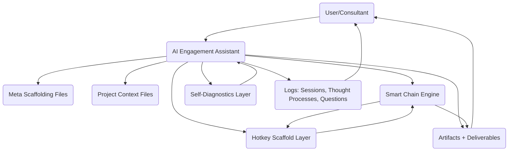
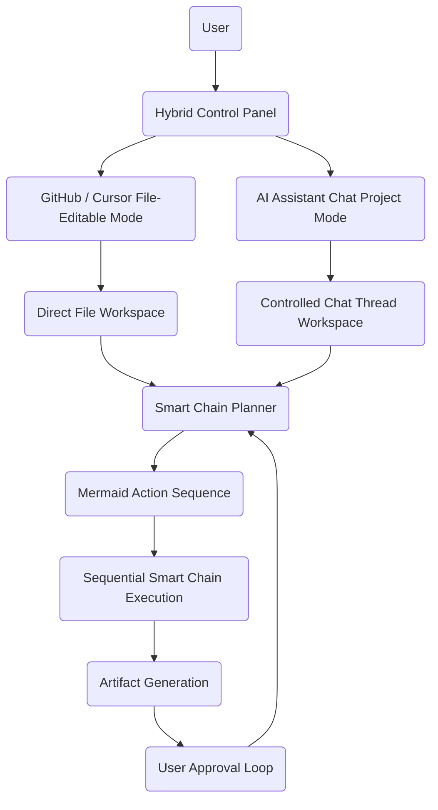
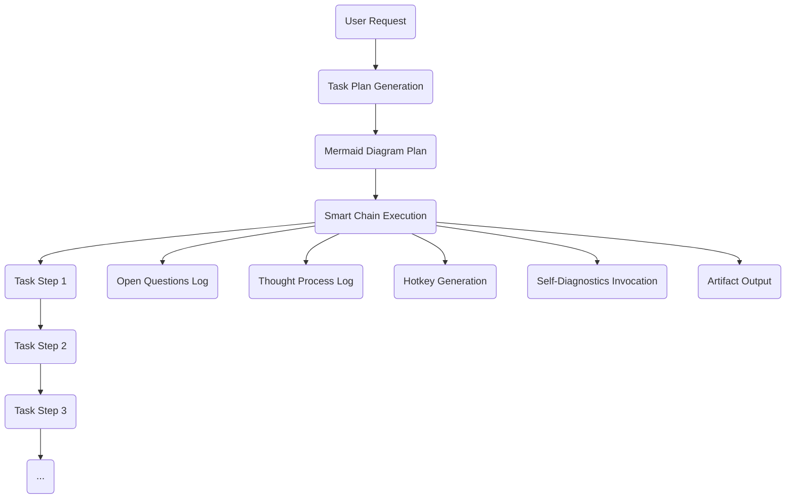
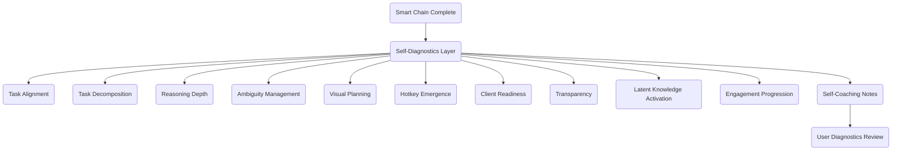
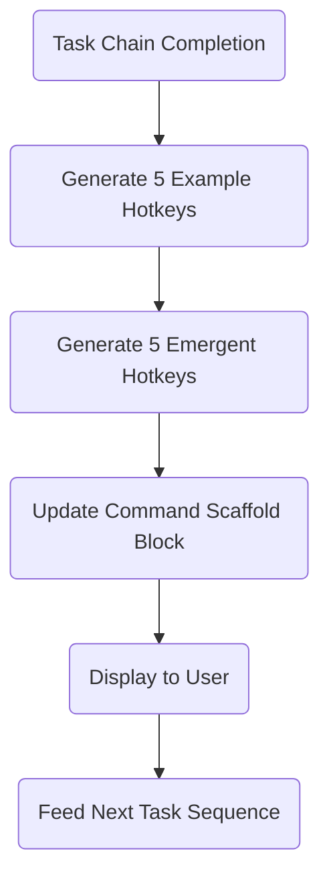
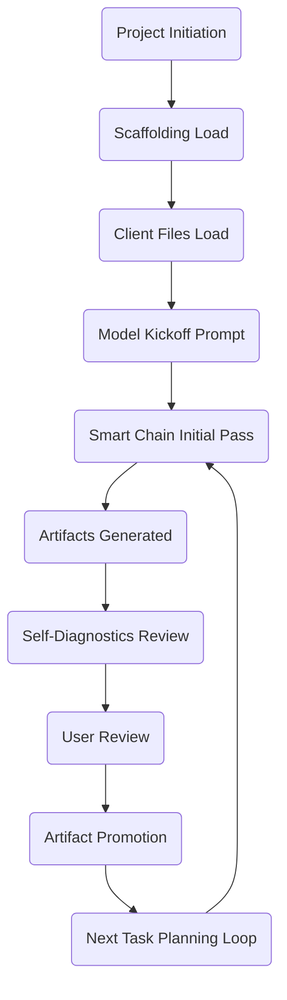

# AI Engagement System — Master Meta-Architecture Diagrams v1.0

---

## Level 1 — Top-Level System Architecture

---

## Level 2 — Hybrid Interface Model (Mode Switching)

---

## Level 3 — Smart Chain Task Engine Flow

---

## Level 4 — Self-Diagnostics & Coaching Layer

---

## Level 5 — Hotkey Scaffold Generator

---

## Level 6 — Full Engagement Lifecycle Flow

